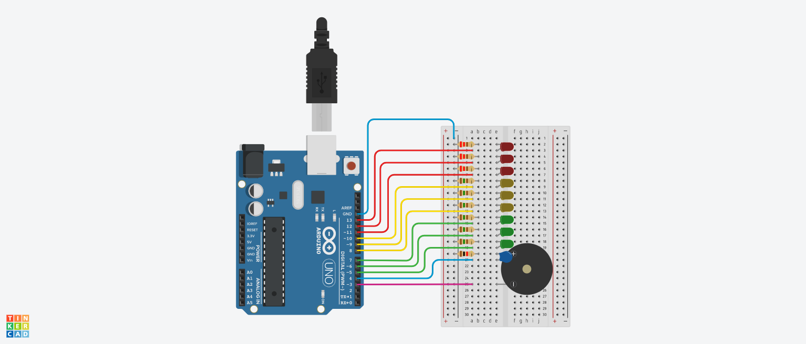

# Dojo Número Uno
## Integrantes
---
* n
* n
* n
* n 
* n
## Proyecto: Semáforo
---

## Descripción
---

## Función principal
---
~~~c++
void loop()
{
  prender_apagar(4500,led_verde_uno,led_verde_dos);
  prender_apagar(5000,led_amarillo_uno,led_amarillo_dos);
  prender_apagar(30000,led_rojo_uno,led_rojo_dos);
  prender_apagar(5000,led_amarillo_uno,led_amarillo_dos);
}
~~~
La función principal llama a la funcion **'prender_apagar'** que recibe como parámetro el tiempo que va a permanecer encendido el led (en milisegundos) y el nombre de los dos led a prender.
~~~c++
void prender_apagar(long ms,int led_uno,int led_dos)
{
  digitalWrite(led_uno, HIGH);
  digitalWrite(led_dos, HIGH);
  determinar_si_suena(led_uno,ms);
  digitalWrite(led_uno, LOW);
  digitalWrite(led_dos, LOW);
  delay(100);
}
~~~
Esta a su vez llama a la función **'determinar_si_suena'** que recibe el tiempo que va a estar sonando y analiza si el buzzer va a sonar dependiendo del led pasado por párametro.
~~~c++
void determinar_si_suena(int led, long ms)
{
    switch(led)
  {
    case led_amarillo_uno:
    	sonar(261,2000,ms);
    break;
    case led_rojo_uno:
    	sonar(440,1000,ms);
    break;
    default:
    	delay(ms);
    break;
  }
}
~~~
Si el led que recibe debe sonar, esta manda a la función **'sonar'** que recibe los Hercios, la frecuencia con la que va a sonar y por cuanto tiempo va a sonar. Por el contrario, si no va a sonar solo espera el tiempo que debe estar encendido.
~~~c++
void sonar(int hz,int frecuencia,int ms)
{
  for(int i=0; i<=ms; i+=frecuencia)
  {
  	tone(buzzer,hz,200);
  	delay(frecuencia);
  }
}
~~~
Esta función va usar la función **'tone'** para activar el buzzer durante el tiempo que se paso por parámetro.
## Link al proyecto
* [Proyecto](https://www.tinkercad.com/things/dH1PiQ4Je0t-tp1/editel?sharecode=0cxTDm9FAhAheCiUiBmaWy3TxTJCfUFdySkuUyj5Yv4)
---
